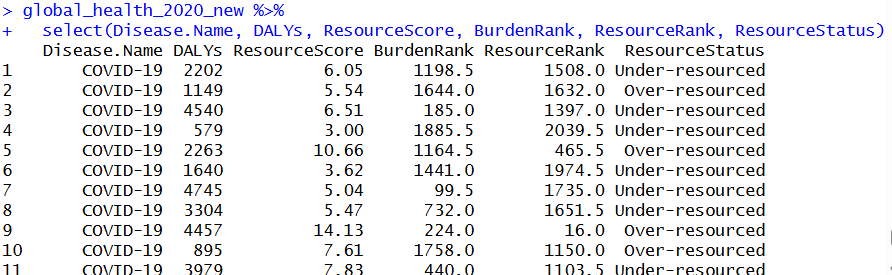
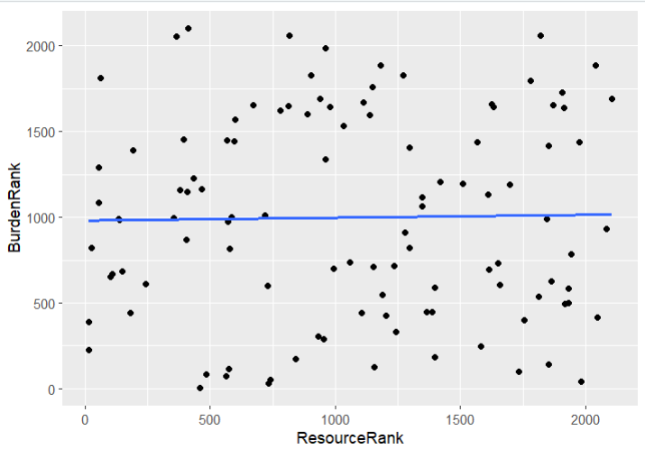
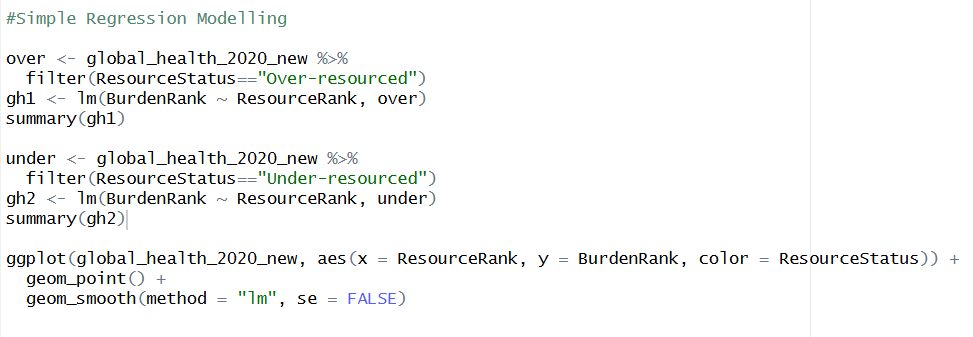
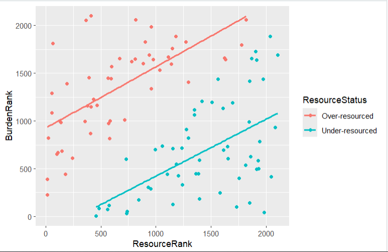
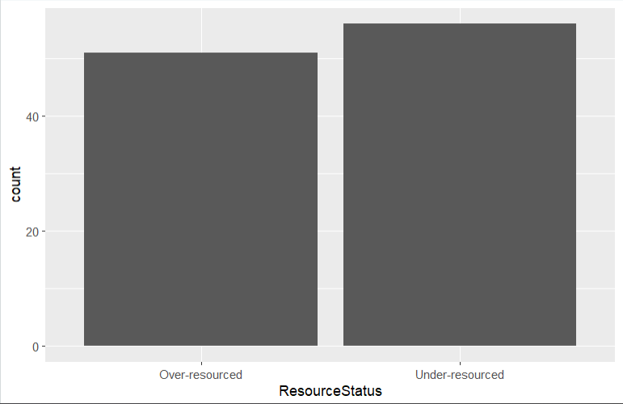
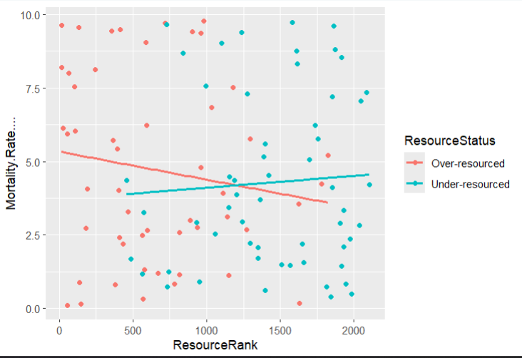
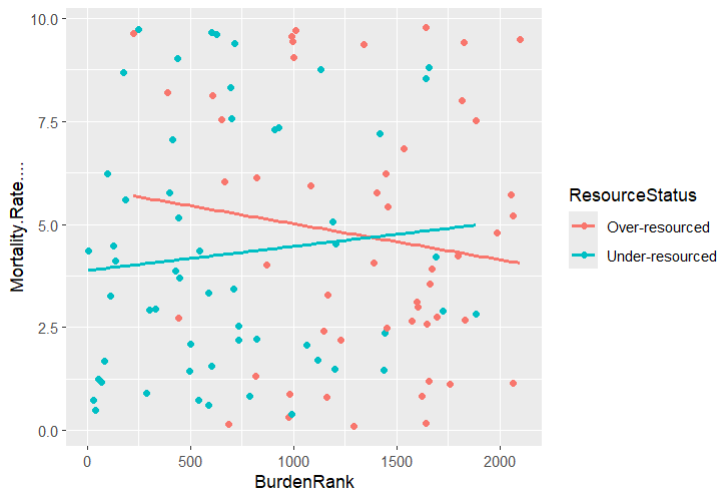

# Health Resources Allocation
## Motivation
I utilized the Kaggle dataset, [Global Health Statistics](https://www.kaggle.com/datasets/malaiarasugraj/global-health-statistics/data?select=Global+Health+Statistics.csv), to understand how access to healthcare resources could impact health outcomes of patients. Focusing on a recent medical incident, I decided to filter the dataset for the year of 2020, looking at data collected from the USA on COVID-19. Through this new filtered dataset, I was able to understand how sufficient allocation of resources could affect disease burden. 

## Data Process
I first loaded the Global Health Dataset csv file to RStudio and created a new dataset called Global_Health_2020_New, which filtered for the Year 2020, Country "USA," and Disease.Name "COVID-19." To evaluate the disease burden in this new dataset, I mutated the DALYs: Disability-Adjusted Life Years column using the RStudio rank() function and negated the DALYs input column to create a BurdenRank column. This ensures that the highly disease burdened data points were ranked higher (towards 1). Then, I mutated the Doctors.per.1000 and Hospital.Beds.per.1000 column by creating a new column, ResourceScore, which took the sum of both counts to establish total amount of resources allocated per 1000 patients. Simiar to the BurdenRank column, I mutated the ResourceScore column to make the ResourceRank column using the rank() function and negated the ResourceScore input column which allowed for the higher amount of resources to be ranked higher (towards 1). Finally, to estalish whether there was sufficent resource collection based on what the disease burden necessated I created the ResourceStatus column. The ResourceStatus column was mutated and used the ifelse() function to assign the string "Over-Resourced" if ResourceRank <= BurdenRank - 5, "Under-Resourced" if ResourceRank >= BurdenRank + 5, and "Proportionate" if neither was true. I made the boundary to be past 5 ranks so that there was a significant difference in healthcare resources allocated and disease burden retained. 

## Visualization
This key visualization displays a scatterplot, showcasing the distribution of the Burden and Resource ranking of the data points. I added a best fit lines to determine the linear relationship that existed between burden and resource rankings. The data seemed to have no relationship with each other, with a best fit line showing only a slight positive linear trend (slope=0.01676, y-int=981.33990). The best fit line has an Adjusted R-squared value of -0.009214, meaning that the Resource Rank does not predict any variation in the Burden Rank data.

## Analytical Technique
I decided to then group the rankings by the resource status of "Over-Resourced" and "Under-Resourced," not including "Proportionate" since no data points matched with this cateogry. 

In taking this approach, there were two positive, linear relationships distinctly prominent amongst the Under-resourced and Over-resourced data points. The Over-resourced dataset had a positive linear trend with a slope=0.6420, y-int=925.8503, and an Adjusted R-squared=0.4137. The Under-resourced dataset has a positive linear trend with a slope=0.5960, y-int= -173.2708, and an Adjusted R-squared=0.2824. Since the Over-resourced datset had a higher Adjusted R-squared, the Resource ranks seemed to explain more variation in the Burden Ranks for the Over-resourced collected data than the Under-resourced data. 

To gauge how efficient data collection was in the USA in 2020 for Covid-19 I used a bar chart with the ggplot() function from the tidyverse package. I noticed that there were more under-resourced collected data than over-resourced data, which could have contributed to the detrimental time of the Covid-19 Pandemic. 

Furthermore, I continued to explore how the rankings had a real time effect on health outcomes by plotting each of the BurdenRank and ResourceRank column with the Mortality.Rate.... column. 

When the Resource Rank was plotted against the Mortality Rate and grouped by Resource Status, for Over-resourced data there was a slope= -0.0009532, y-int=5.3372561, and an Adjusted R-squared=0.001827 and for Under-resourced data there was a slope=0.0004040, y-int=3.7054300, and Adjusted R-squared=-0.01444. This conveys that the Under-resourced data's mortality rates are not at all explained by resource rank, whereas there is a slight negative linear relationship that weakly explains the Over-resourced data mortality's rate by the resource rank.

Finally, when the Burden Rank was plotted against the Mortality Rate and grouped by Resource Status, for Over-resourced data there was a slope= -0.0008713, y-int=5.8887989, and an Adjusted R-squared=-0.002405 and for Under-resourced data there was a slope=0.0005836, y-int=3.8875588, and Adjusted R-squared= -0.008295. This conveys that both the Under-resourced and Over-resourced data's mortality rates are not at all explained by resource rank. 

These analyses indicate that further exploration needs to be done on how healthcare resource allocation and disease burden during the Covid-19 Pandemic implicated the US population. 